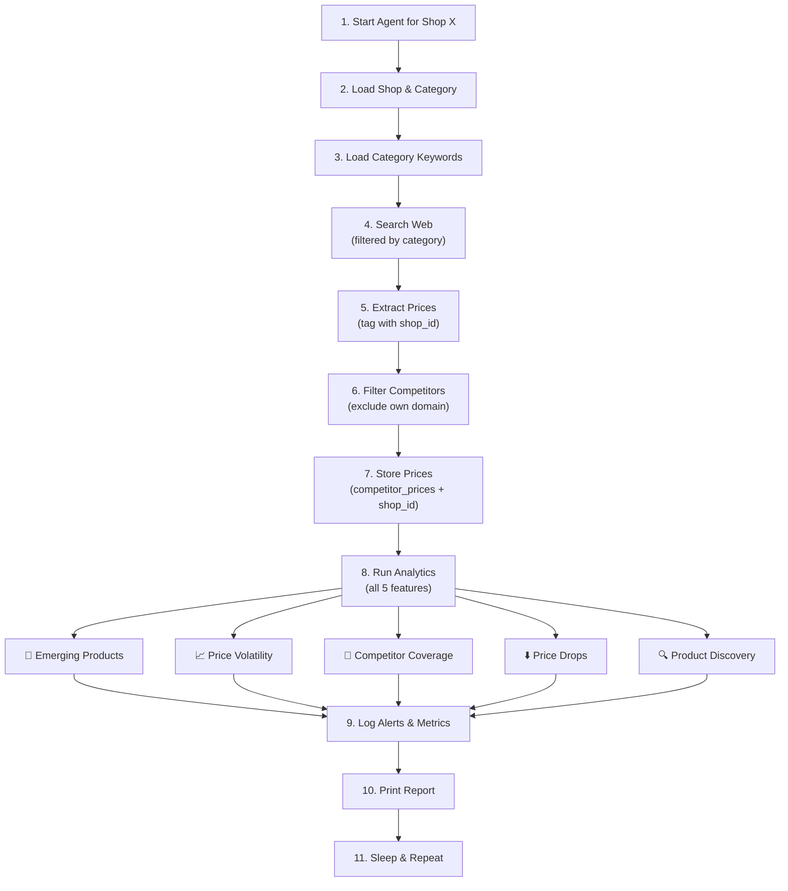

# 🚀 AGENT-SIDE REQUIREMENTS: Multi-Tenant Analytics System

## 📋 Overview

Your system is being upgraded to support **multiple shops** with **5 analytics features**. This document outlines all **agent-side requirements only** (no UI changes).

---

## 📦 New Agent Modules Created

### 1. **agent_analytics.py** (500 lines)
Core analytics engine with 5 features:
- `AnalyticsEngine` class
- `EmergingProduct`, `PriceVolatility`, `CompetitorMarketShare`, `PriceDrop`, `DiscoveredProduct` dataclasses
- `run_full_analytics_cycle()` - runs all 5 features at once

**5 Features Implemented:**
1. ✅ Emerging Product Radar
2. ✅ Price Volatility Score
3. ✅ Competitor Coverage Map
4. ✅ Price Drop Detector
5. ✅ Automatic Product Discovery

### 2. **shop_manager.py** (400 lines)
Multi-tenant shop management:
- `ShopManager` - create/manage shops
- `CategoryKeywordManager` - category-specific keywords
- `ProductDiscoveryFilter` - filter products to shop's category

**Key Classes:**
- `Shop` - shop configuration
- `CategoryKeywords` - category-specific keyword sets
- Pre-built categories: electronics, fashion, appliances, books, home

### 3. **SCHEMA_ADDITIONS.sql** (300 lines)
Database schema additions:
- `shops` - multi-tenant table
- `product_metadata` - track first-seen dates
- `product_volatility` - volatility metrics
- `competitor_coverage` - market share tracking
- `emerging_products` - emerging product alerts
- `price_drops` - price drop alerts
- `product_discovery_log` - cycle metrics
- Helper functions for each analytics feature

### 4. **AGENT_INTEGRATION_GUIDE.md** (400 lines)
Complete integration guide with examples

---

## 🔧 Agent Core Modifications Required

### In `agent_core.py`:

#### 1. Add Imports
```python
from shop_manager import ShopManager, CategoryKeywordManager, ProductDiscoveryFilter
from agent_analytics import AnalyticsEngine
```

#### 2. Add to `__init__`
```python
def __init__(self, db: SupabaseStore, shop_id: int = 1):
    self.db = db
    self.shop_id = shop_id  # NEW
    self.agent = AgentReasoningCore(self.db, shop_id=shop_id)  # NEW PARAM
    self.shop_mgr = ShopManager(self.db)  # NEW
    self.keyword_mgr = CategoryKeywordManager(self.db)  # NEW
    self.analytics = AnalyticsEngine(self.db)  # NEW
    self.filter = None  # NEW - will be set in initialize()
```

#### 3. Modify `initialize()` method
```python
async def initialize(self):
    # Existing code...
    
    # NEW: Load shop and filter
    shop = await self.shop_mgr.get_shop(self.shop_id)
    self.filter = ProductDiscoveryFilter(shop)
    
    # NEW: Get category-specific keywords
    keywords = await self.keyword_mgr.get_active_keywords_for_shop(
        self.shop_id,
        shop.category,
        limit=500
    )
    await self.db.initialize_keyword_pool_for_shop(self.shop_id, shop.category)
    
    # Mark shop as active
    await self.shop_mgr.update_shop_last_active(self.shop_id)
```

#### 4. Modify `search_web()` in `agent_tools.py`
```python
async def search_web(query: str, shop_id: int = None) -> List[str]:
    """Search web for competitors (excluding own domain)"""
    
    shop = await ShopManager(db).get_shop(shop_id)
    filter = ProductDiscoveryFilter(shop)
    
    # 1. Enhance query with category
    enhanced_query = filter.format_search_query(query)
    
    # 2. Search
    urls = await duckduckgo_search(enhanced_query)
    
    # 3. Filter competitors (remove own domain)
    filtered = filter.filter_competitors(
        [extract_domain(url) for url in urls],
        shop.shop_domain
    )
    
    # 4. Return competitor URLs
    return [url for url in urls if extract_domain(url) in filtered]
```

#### 5. Modify `run_cycle()` method
```python
async def run_cycle(self):
    """Run one agent cycle with analytics"""
    
    # Existing search/browse/score logic...
    
    # NEW: Mark shop active and update last_active
    await self.shop_mgr.update_shop_last_active(self.shop_id)
    
    # Run analytics suite (all 5 features)
    analytics_results = await self.analytics.run_full_analytics_cycle(self.shop_id)
    
    # Return results including analytics
    return {
        "prices_found": prices_found,
        "analytics": analytics_results
    }
```

#### 6. Modify `shutdown()` method
```python
async def shutdown(self):
    """Clean shutdown"""
    # Existing code...
    
    # NEW: Final analytics run
    final_results = await self.analytics.run_full_analytics_cycle(self.shop_id)
    print(f"[Agent] Final Analytics Report:")
    print(self.analytics.format_analytics_report(final_results, self.shop_id))
```

---

## 🗄️ Database Changes Required

### Run SCHEMA_ADDITIONS.sql

This creates:
- ✅ `shops` table (multi-tenant)
- ✅ `product_metadata` table (first-seen tracking)
- ✅ `product_volatility` table (volatility metrics)
- ✅ `competitor_coverage` table (market share)
- ✅ `emerging_products` table (alerts)
- ✅ `price_drops` table (alerts)
- ✅ `product_discovery_log` table (metrics)

### Add Columns to Existing Tables
```sql
ALTER TABLE competitor_prices ADD COLUMN shop_id BIGINT REFERENCES shops(id);
ALTER TABLE keyword_pool ADD COLUMN shop_id BIGINT REFERENCES shops(id);
ALTER TABLE keyword_pool ADD COLUMN product_category VARCHAR(100);
ALTER TABLE price_history ADD COLUMN shop_id BIGINT REFERENCES shops(id);

-- Create indexes
CREATE INDEX idx_competitor_prices_shop ON competitor_prices(shop_id);
CREATE INDEX idx_keyword_pool_shop_category ON keyword_pool(shop_id, product_category);
```

---

## 📊 5 Analytics Features Breakdown

### Feature 1: 🚀 Emerging Product Radar
**Database Table:** `emerging_products`  
**Function:** `detect_emerging_products(shop_id, hours=24)`  
**Logic:** Product <24h old AND appears on ≥2 retailers  
**Output:** List of EmergingProduct objects

**Use in Agent:**
```python
emerging = await analytics.detect_emerging_products(shop_id)
for product in emerging:
    print(f"🚀 NEW: {product.product_name} ({product.retailer_count} retailers)")
    await analytics.log_emerging_product_alert(shop_id, product)
```

### Feature 2: 📈 Price Volatility Score
**Database Table:** `product_volatility`  
**Function:** `calculate_price_volatility(shop_id, product_name)`  
**Logic:** STD_DEV(all prices) for product → volatility_score  
**Output:** PriceVolatility object with score and level (Low/Medium/High/Extreme)

**Use in Agent:**
```python
volatilities = await analytics.get_all_volatilities(shop_id, min_sample_count=3)
for vol in volatilities:
    if vol.volatility_level in ["High", "Extreme"]:
        print(f"📈 VOLATILE: {vol.product_name} (score: {vol.volatility_score:.1f})")
```

### Feature 3: 🏪 Competitor Coverage Map
**Database Table:** `competitor_coverage`  
**Function:** `get_competitor_coverage_by_category(shop_id, category)`  
**Logic:** COUNT(products) per competitor per category → market_share %  
**Output:** List of CompetitorMarketShare sorted by dominance

**Use in Agent:**
```python
coverage = await analytics.get_coverage_map_all_categories(shop_id)
for category, competitors in coverage.items():
    leader = competitors[0]
    print(f"🏪 {category}: {leader.competitor_domain} ({leader.market_share_percent:.1f}%)")
```

### Feature 4: ⬇️ Price Drop Detector
**Database Table:** `price_drops`  
**Function:** `detect_price_drops(shop_id, threshold_percent=5.0)`  
**Logic:** IF (old_price - new_price) / old_price ≥ 5% → flag  
**Output:** List of PriceDrop objects sorted by significance

**Use in Agent:**
```python
drops = await analytics.detect_price_drops(shop_id, threshold_percent=5.0)
for drop in drops:
    print(f"⬇️  DROP: {drop.product_name} @ {drop.competitor_domain}")
    print(f"    {drop.old_price:.2f} → {drop.new_price:.2f} (-{drop.drop_percent:.1f}%)")
    await analytics.log_price_drop_alert(shop_id, drop)
```

### Feature 5: 🔍 Automatic Product Discovery
**Database Table:** `product_metadata`  
**Function:** `auto_discover_products(shop_id)`  
**Logic:** Product on ≥2 retailers → trending; confidence = retailer_count × 20  
**Output:** List of DiscoveredProduct sorted by confidence_score

**Use in Agent:**
```python
discovered = await analytics.auto_discover_products(shop_id)
for product in discovered[:10]:
    print(f"🔍 FOUND: {product.product_name} ({product.confidence_score:.0f}% confidence)")
    print(f"   {product.retailer_count} retailers: {', '.join(product.retailer_list[:3])}")
    await analytics.log_discovered_product(shop_id, product)
```

---

## 🔄 Complete Agent Cycle Workflow



---

## 🗂️ File Organization

**New Files:**
- `agent_analytics.py` - Core analytics engine
- `shop_manager.py` - Multi-tenant management
- `SCHEMA_ADDITIONS.sql` - Database additions
- `AGENT_INTEGRATION_GUIDE.md` - Integration examples

**Files to Modify:**
- `agent_core.py` - Add shop context + analytics call
- `agent_tools.py` - Filter competitors, tag with shop_id
- `agent_engine.py` - Accept shop_id parameter
- `database.py` - Add shop_id support for queries

---

## ⚙️ Configuration

### Environment Variables
```env
# Agent Shop Context
AGENT_SHOP_ID=1
AGENT_SHOP_NAME=ElectroHub
AGENT_SHOP_CATEGORY=electronics

# Analytics Settings
EMERGING_PRODUCT_HOURS=24
PRICE_DROP_THRESHOLD_PERCENT=5.0
MIN_RETAILER_COUNT=2
MIN_VOLATILITY_SAMPLES=3
```

### Command Line Usage
```bash
# Run agent for specific shop
python3 agent_engine.py --shop-id=1

# Run for different shop
python3 agent_engine.py --shop-id=2

# Multi-shop concurrent run (in custom script)
for shop_id in 1 2 3 4 5; do
    python3 agent_engine.py --shop-id=$shop_id &
done
```

---

## 📊 Agent Output Changes

### Before (Generic)
```
[Agent] Cycle 10: 45 prices found, 5 processed
...
```

### After (With Analytics)
```
================================================================================
                    PRODUCT ANALYTICS REPORT
================================================================================

📊 CYCLE SUMMARY
Processing time: 12.3s

🚀 EMERGING PRODUCTS (3)
  1. Sony WH-1000XM6 (3h old, 3 retailers)
     └─ amazon.com, flipkart.com, bestbuy.com

📈 PRICE VOLATILITY - HIGH RISK (2 products)
  1. iPhone 15 (Volatility: 45.23)
     └─ Range: ₹150000 - ₹165000 (12 prices)

🏪 COMPETITOR COVERAGE BY CATEGORY
  electronics:
    • amazon.com: 156 products (34.7%)
    • flipkart.com: 142 products (31.6%)

⬇️ PRICE DROPS DETECTED (4)
  1. Samsung Galaxy S24 @ amazon.com
     └─ ₹72000 → ₹69999 (-4.2% drop)

🔍 AUTO-DISCOVERED PRODUCTS (top 5)
  1. Samsung Galaxy S24 (Confidence: 100%)
     └─ 5 retailers: amazon, flipkart, bestbuy, newegg, walmart

================================================================================
```

---

## ✅ Implementation Checklist

### Phase 1: Database Setup
- [ ] Run SCHEMA_ADDITIONS.sql
- [ ] Add shop_id columns to existing tables
- [ ] Create indexes
- [ ] Create test shop via ShopManager

### Phase 2: Agent Core Modifications
- [ ] Import new modules in agent_core.py
- [ ] Add shop_id parameter to AgentReasoningCore.__init__()
- [ ] Modify initialize() to load shop and keywords
- [ ] Modify search_web() to filter competitors
- [ ] Modify run_cycle() to call analytics
- [ ] Modify shutdown() to run final analytics

### Phase 3: Testing
- [ ] Test ShopManager (create/get shop)
- [ ] Test CategoryKeywordManager (initialize keywords)
- [ ] Test AnalyticsEngine (run individual features)
- [ ] Test complete agent cycle with one shop

### Phase 4: Multi-Shop Support
- [ ] Run agent for multiple shops concurrently
- [ ] Verify shop isolation (no cross-shop data)
- [ ] Test analytics for each shop independently
- [ ] Verify database queries filter by shop_id

### Phase 5: Deployment
- [ ] Document shop initialization process
- [ ] Setup monitoring for each shop
- [ ] Configure alert channels (if needed)
- [ ] Plan cooldown period between cycles

---

## 🎯 Success Criteria

After implementation, agent should:

✅ Support multiple shops/tenants  
✅ Filter products by shop's category  
✅ Only track competitor domains (exclude own)  
✅ Generate 5 analytics reports per cycle  
✅ Create database alerts for anomalies  
✅ Store all metrics for history/trending  
✅ Process 1000+ prices per cycle per shop  
✅ Complete cycle in <30 seconds  
✅ Run multiple shops concurrently  
✅ recover from failures gracefully  

---

## 📞 Integration Support

**For questions about:**
- **Analytics features** → See `agent_analytics.py` docstrings
- **Multi-tenant setup** → See `shop_manager.py` docstrings
- **Database schema** → See `SCHEMA_ADDITIONS.sql` comments
- **Integration examples** → See `AGENT_INTEGRATION_GUIDE.md`

---

## 🎬 Quick Start

```bash
# 1. Run schema additions (one-time)
# Upload SCHEMA_ADDITIONS.sql to Supabase

# 2. Create a shop
python3 -c "
from shop_manager import ShopManager
from database import SupabaseStore
import asyncio

async def init():
    db = SupabaseStore()
    mgr = ShopManager(db)
    shop = await mgr.create_shop('MyShop', 'myshop.com', 'electronics')
    print(f'Shop created: {shop.id}')

asyncio.run(init())
"

# 3. Run agent for that shop
python3 agent_engine.py --shop-id=1

# 4. Agent will:
#    - Load shop configuration
#    - Initialize category keywords
#    - Search for competitors (not own domain)
#    - Run all 5 analytics
#    - Print report
#    - Sleep and repeat
```

---

**Status:** ✅ Agent-side ready for integration  
**Next Step:** Modify agent_core.py to integrate these modules
